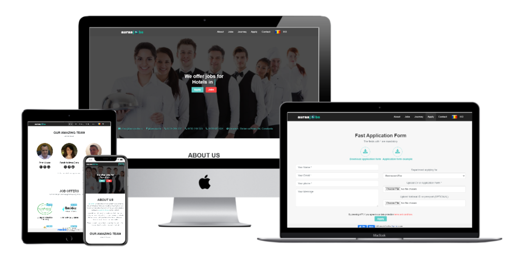

# 

> ### Production used single-page website built for own business using CRUD, advanced patterns and Laravel, Jquery, Sass, MySQL utilities. The app is used in production for a Recruiting agency, candidates can apply directly through a form on the website. The client will receive an email for each application or contact request, currently working on an admin page where he can manage the database of the candidate's applications and contact requests.

----------

## Website mockup



# Getting started

## Installation

Please check the official laravel installation guide for server requirements before you start. [Official Documentation](https://laravel.com/docs/5.4/installation#installation)


Clone the repository

    `git clone git@github.com:cristianCeamatu/aurasjobs.ro-laravel.git`

Switch to the repo folder

    `cd aurasjobs.ro-laravel`

Install all the dependencies using composer

    `composer install`

Install all the javascript dependencies using npm

    `npm install`

Start the local development server

    `php artisan serve`

You can now access the server at http://localhost:8000

**TL;DR command list**

```
    git clone git@github.com:cristianCeamatu/aurasjobs.ro-laravel.git
    cd aurasjobs.ro-laravel
    composer install
    npm install
    php artisan serve
```

## Database seeding
